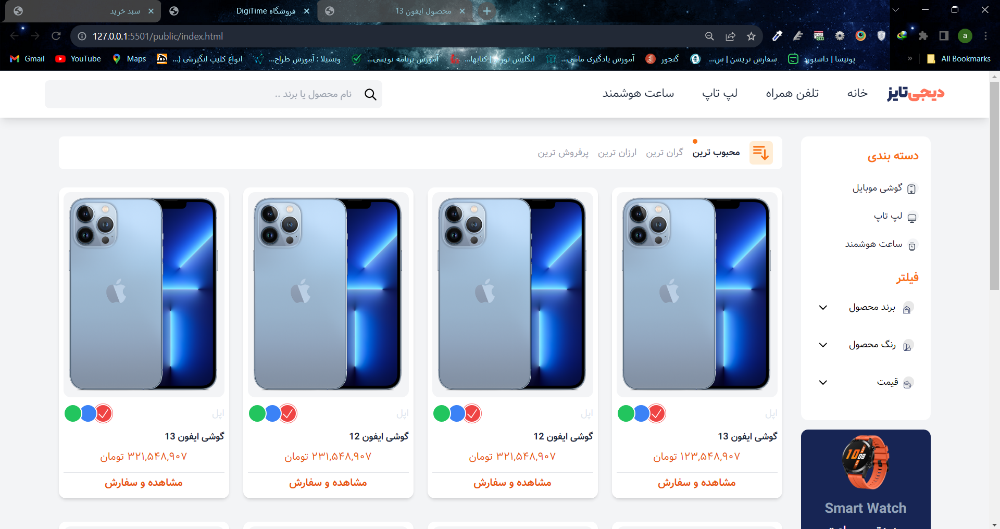
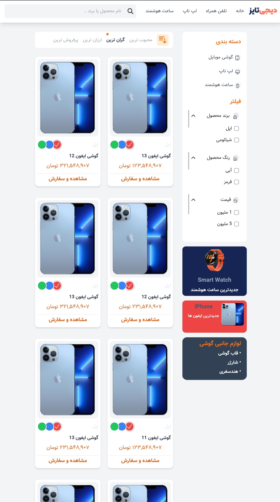

# Shop-DigiTaize
Building the initial store of DigiTime with Tawillcss and html/css and javascript.
\
Technologies for making this program :   Tawillcss and html\css and Javascript 
\
What is Tawill css : Tailwind CSS is an open source CSS framework. The main feature of this library is that, unlike other CSS frameworks like Bootstrap, it does not provide a series of predefined classes for elements such as buttons or tables.
\
Site:https://tailwindcss.com/
#
# Desktop View

#

#

#
# Tablet  View

#

#

#
# Mobile Veiw

#

#

